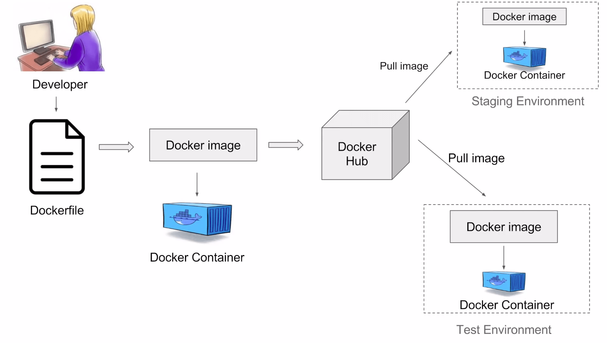

# Hi there 👋

## Thanks for reading and I hope this will be help you.

## <b>What is Docker? </b>


<ul>
    <li>Docker is a containerization platform that allows you to package an application and its dependencies into a standardized unit called a container.</li>
    <li>This container can then be run consistently across different environments, providing a predictable and isolated environment for your application to run.</li>
</ul>

```s
./install-docker.sh
```

## <b>Docker Workflow</b>



<span>
The Developer's code has completed some function
then we will need to write <br>
<b>Dockerfile → build a Docker image → run Docker containers </b>
</span>

## <b>Base Image</b>

### <b>☕ Java </b>

<ul>
    <li>openjdk:17-alpine</li>
    <li>openjdk:17.0.2-jdk</li>
    <li>eclipse-temurin:8-jre-alpine</li>
    <li>eclipse-temurin:11-jre-alpine</li>
    <li>eclipse-temurin:17-jre-alpine</li>
    <li>eclipse-temurin:21-jre-alpine</li>
    <li>amazoncorretto:17.0.0-alpine</li>
    <li>amazoncorretto:8u382-al2023</li>
</ul>

<br/>
